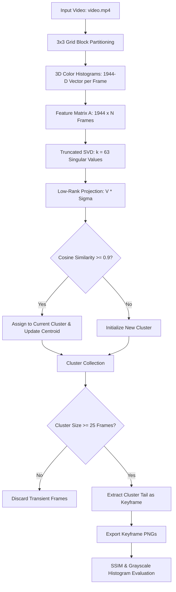

# Key Frames Extraction From Videos Using Singular Value Decomposition (SVD)


An unsupervised computer vision and linear algebra pipeline designed to extract representative, informative keyframes from video sequences while eliminating temporal redundancy. The framework utilizes **Singular Value Decomposition (SVD)**, **Dynamic Clustering**, and **Cosine Similarity** to identify significant visual changes and generate a concise summary of video content.

---

## 📌 Problem Definition & Pipeline Architecture

Video summarization and indexing require identifying a concise subset of frames that capture major content shifts without retaining repetitive frames. This framework extracts keyframes through a multi-stage linear algebra and clustering workflow:

* **Step 1 (Spatio-Color Feature Extraction):** Each frame is converted to RGB and partitioned into a $3 \times 3$ spatial grid (9 blocks). A 3D joint color histogram ($6 \times 6 \times 6 = 216$ bins) is computed for each block and flattened into a single $1944$-dimensional feature vector ($9 \times 216$) per frame.
* **Step 2 (Feature Matrix Construction & SVD):** The vectors are arranged column-wise into a feature matrix $A \in \mathbb{R}^{1944 \times N}$ (where $N$ is the number of frames). Truncated SVD decomposes $A$ into $U \Sigma V^T$ to retain the top $k = 63$ singular values and project the frames into a lower-dimensional subspace ($V \Sigma \in \mathbb{R}^{N \times 63}$).
* **Step 3 (Dynamic Online Clustering):** Frame projections are sequentially clustered by computing the cosine similarity between the current frame vector and the running centroid of the active cluster. If similarity drops below $0.9$, a new cluster is created; otherwise, the frame is assigned to the current cluster and its centroid is updated.
* **Step 4 (Dense Cluster Filtering & Keyframe Selection):** Formed clusters are filtered by size to keep only dense groups ($\ge 25$ frames), discarding noise and minor transitions. The final (tail) frame of each dense cluster is extracted as the representative keyframe.
* **Step 5 (Validation & Analysis):** Candidate keyframes are evaluated using pairwise **Structural Similarity Index Measure (SSIM)** to measure visual diversity and **Grayscale Histograms** to verify intensity distribution.


## 📐 Mathematical Formulation

### 1. Singular Value Decomposition (SVD)
The feature matrix $A \in \mathbb{R}^{M \times N}$ (where $M = 1944$ features and $N$ is the number of video frames) is decomposed into:

$$A = U \Sigma V^T$$

* **$U$**: Left singular vectors (spatial information of frames).
* **$\Sigma$**: Singular values (temporal variations across the sequence).
* **$V^T$**: Right singular vectors.

Frames are projected onto the reduced basis using the top $k = 63$ components:

$$\text{Projections} = V \Sigma \in \mathbb{R}^{N \times 63}$$

---

### 2. Cosine Similarity
The similarity between a projected frame vector $A$ and a cluster centroid $B$ is measured as:

$$\text{Cosine Similarity} = \frac{A \cdot B}{\Vert A \Vert_2 \Vert B \Vert_2}$$

* Values range from $-1$ (dissimilar) to $1$ (identical).
* A threshold of **0.9** is applied to evaluate similarity and trigger cluster creation.

---

## 📊 Evaluation Metrics

* **Structural Similarity Index Measure (SSIM):** Evaluates pairwise similarity across selected keyframes to ensure visual diversity and minimize redundancy.
* **Grayscale Intensity Histograms:** Analyzes pixel intensity distributions to confirm dynamic lighting and scene variation across extracted shots.

---

## 🛠️ Tech Stack & Libraries

* **OpenCV (`cv2`):** Video decoding, frame extraction, color space conversion, and 3D histogram calculation.
* **NumPy:** Matrix manipulation, vector operations, and array stacking.
* **SciPy (`scipy.sparse.linalg`):** Sparse matrix SVD computation (`svds`).
* **Pandas:** Tabular clustering index alignment and grouping operations.
* **Matplotlib:** Plotting grayscale histograms and image grids.
* **Scikit-Image (`skimage.metrics`):** Structural Similarity Index (SSIM) computation.

## ⚙️ Quickstart

### 1. Clone & Setup Environment

```bash
git clone [https://github.com/](https://github.com/)<your-username>/keyframe-extraction-svd.git
cd keyframe-extraction-svd
pip install -r requirements.txt
```
### 2. Run Extraction Pipeline

Open and execute `FinalCode.ipynb` to process `video.mp4` and export candidate keyframes into the `output/` directory.
